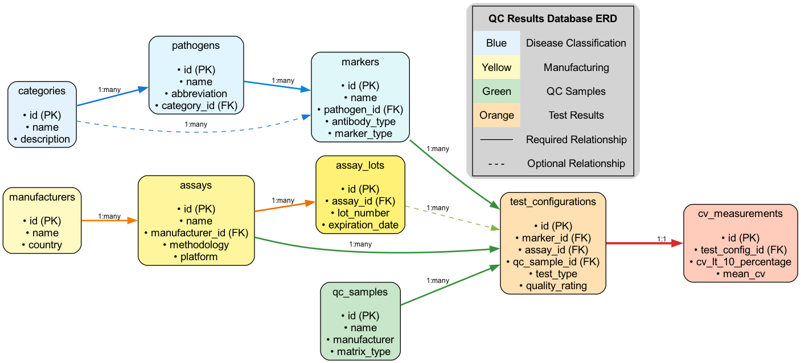
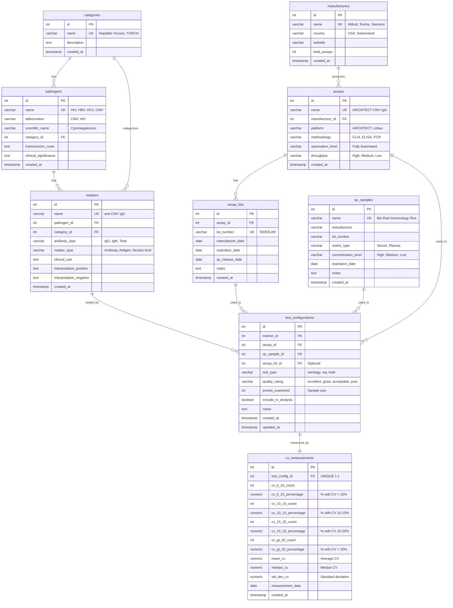

# Entity Relationship Diagram (ERD)

**Database:** QC Results Database
**Generated:** 2025-11-13
**Schema Version:** 1.0.0

---

## 🖼️ Visual Diagrams

### High-Resolution Diagram



**Files:**
- **PNG:** [ERD-diagram.png](ERD-diagram.png) - High-resolution raster image
- **SVG:** [ERD-diagram.svg](ERD-diagram.svg) - Scalable vector graphic
- **Source:** `scripts/generate-erd-simple.dot` (Graphviz DOT format)

**To regenerate:**
```bash
dot -Tpng scripts/generate-erd-simple.dot -o readme/database/ERD-diagram.png
dot -Tsvg scripts/generate-erd-simple.dot -o readme/database/ERD-diagram.svg
```

---

## 📋 Quick Reference (ASCII)

```
┌─────────────────┐         ┌──────────────────┐
│   categories    │────────▶│    pathogens     │
│  (Disease       │  1:many │  (Infectious     │
│   Categories)   │         │   Agents)        │
└─────────────────┘         └──────────────────┘
         │                           │
         │                           │ 1:many
         │ 1:many                    ▼
         │                  ┌──────────────────┐
         └─────────────────▶│     markers      │
                            │  (Test Markers)  │
                            └──────────────────┘
                                     │
                                     │ 1:many
                                     ▼
                            ┌──────────────────┐      ┌────────────────┐
┌──────────────────┐        │       test       │      │       cv       │
│ manufacturers    │        │  configurations  │─────▶│  measurements  │
│  (Companies)     │        │   (Core Entity)  │ 1:1  │ (Performance)  │
└──────────────────┘        └──────────────────┘      └────────────────┘
         │                    ▲      ▲      ▲
         │ 1:many             │      │      │
         ▼                    │      │      │
┌──────────────────┐          │      │      │
│     assays       │──────────┘      │      │
│  (Test Systems)  │   1:many        │      │
└──────────────────┘                 │      │
         │                           │      │
         │ 1:many                    │      │
         ▼                           │      │
┌──────────────────┐                 │      │
│   assay_lots     │─────────────────┘      │
│  (Batch #s)      │      1:many            │
└──────────────────┘                        │
                                            │
                               ┌────────────┘
                               │ 1:many
                               │
                      ┌──────────────────┐
                      │   qc_samples     │
                      │  (QC Materials)  │
                      └──────────────────┘

Legend: ────▶ Required    ----▶ Optional
```

---

## Visual ERD (Mermaid)



---

## Relationships Explained

### Primary Hierarchies

#### 1. Disease Classification Hierarchy
```
categories (Disease Categories)
    ↓ 1:many
pathogens (Infectious Agents)
    ↓ 1:many
markers (Test Markers)
```

**Example:**
- Category: "TORCH Panel"
  - Pathogen: "Cytomegalovirus (CMV)"
    - Marker: "anti-CMV IgG"
    - Marker: "anti-CMV IgM"

#### 2. Manufacturing Hierarchy
```
manufacturers (Abbott, Roche, etc.)
    ↓ 1:many
assays (ARCHITECT, cobas, etc.)
    ↓ 1:many
assay_lots (Specific production batches)
```

**Example:**
- Manufacturer: "Abbott"
  - Assay: "ARCHITECT CMV IgG"
    - Lot: "93093LI00" (expires 2025-12-31)

#### 3. Test Configuration (Central Entity)
```
marker + assay + qc_sample [+ assay_lot] → test_configuration
```

**Purpose:** Links a specific marker with a specific assay and QC sample to create a unique test configuration.

**Example:**
- Marker: "anti-CMV IgG"
- Assay: "ARCHITECT CMV IgG"
- QC Sample: "Bio-Rad Immunology Plus"
- Assay Lot: "93093LI00" *(optional)*
- **Result:** Unique test configuration with CV performance data

#### 4. Performance Measurement
```
test_configuration (1:1) → cv_measurements
```

**Purpose:** Each test configuration has exactly one set of CV measurements showing performance metrics.

---

## Cardinality Reference

| Relationship | Cardinality | Description |
|--------------|-------------|-------------|
| **categories → pathogens** | 1:many | One category contains many pathogens |
| **categories → markers** | 1:many | One category contains many markers |
| **pathogens → markers** | 1:many | One pathogen has many markers |
| **manufacturers → assays** | 1:many | One manufacturer produces many assays |
| **assays → assay_lots** | 1:many | One assay has many production lots |
| **assays → test_configurations** | 1:many | One assay used in many test configs |
| **markers → test_configurations** | 1:many | One marker tested by many configs |
| **qc_samples → test_configurations** | 1:many | One QC sample used in many configs |
| **assay_lots → test_configurations** | 1:many | One lot used in many configs *(optional)* |
| **test_configurations → cv_measurements** | 1:1 | One config has exactly one measurement set |

---

## Unique Constraints

### Composite Unique Constraints

**test_configurations:**
- `(marker_id, assay_id, qc_sample_id)` → Each combination must be unique
- Ensures no duplicate test configurations

**Example:**
- ✅ Valid: CMV IgG + ARCHITECT + Bio-Rad Sample A
- ✅ Valid: CMV IgG + ARCHITECT + Bio-Rad Sample B (different QC sample)
- ❌ Invalid: CMV IgG + ARCHITECT + Bio-Rad Sample A (duplicate)

### Single-Column Unique Constraints

- `categories.name` → No duplicate category names
- `pathogens.name` + `pathogens.category_id` → No duplicate pathogens within category
- `markers.name` + `markers.pathogen_id` → No duplicate markers for pathogen
- `manufacturers.name` → No duplicate manufacturer names
- `assays.name` + `assays.manufacturer_id` → No duplicate assays from manufacturer
- `qc_samples.name` + `qc_samples.lot_number` → No duplicate QC samples
- `assay_lots.lot_number` → No duplicate lot numbers
- `cv_measurements.test_config_id` → One measurement set per config

---

## Check Constraints

### Enumerated Types (Must Match)

**markers.antibody_type:**
- `IgG`, `IgM`, `Antigen`, `Antibody (Total)`, `Other`

**markers.marker_type:**
- `Antibody`, `Antigen`, `Nucleic Acid`

**assays.methodology:**
- `CLIA`, `ELISA`, `PCR`, `ECLIA`, `CMIA`

**assays.automation_level:**
- `Fully Automated`, `Semi-Automated`, `Manual`

**test_configurations.test_type:**
- `serology`, `nat` (nucleic acid testing), `both`

**test_configurations.quality_rating:**
- `excellent`, `good`, `acceptable`, `poor`, `unknown`

### Percentage Validation (cv_measurements)

All percentage fields must be between 0 and 100:
- `cv_lt_10_percentage >= 0 AND <= 100`
- `cv_10_15_percentage >= 0 AND <= 100`
- `cv_15_20_percentage >= 0 AND <= 100`
- `cv_gt_20_percentage >= 0 AND <= 100`

---

## Foreign Key Cascade Behavior

All foreign keys use **CASCADE on DELETE** to maintain referential integrity:

**Example:**
- Delete a manufacturer → All associated assays are deleted
- Delete an assay → All associated test configurations are deleted
- Delete a test configuration → Associated cv_measurements are deleted

**Important:** Cascading deletes are destructive. Use with caution in production.

---

## Views (Denormalized Data)

### vw_test_config_details
**Purpose:** Pre-joined view combining all test configuration details
**Joins:** test_configurations + markers + pathogens + categories + assays + manufacturers + qc_samples + cv_measurements
**Use Case:** Fast querying for search, filtering, and comparison features

**Sample Query:**
```sql
SELECT * FROM vw_test_config_details
WHERE pathogen_abbreviation = 'CMV'
  AND cv_lt_10_percentage > 90
ORDER BY cv_lt_10_percentage DESC;
```

### vw_manufacturer_performance
**Purpose:** Aggregated performance metrics by manufacturer
**Aggregations:** Total configs, avg CV <10%, quality rating counts
**Use Case:** Dashboard manufacturer rankings and performance comparison

**Sample Query:**
```sql
SELECT name, avg_cv_lt_10_pct, total_configs
FROM vw_manufacturer_performance
WHERE total_configs >= 5
ORDER BY avg_cv_lt_10_pct DESC;
```

---

## Data Flow Example

### Adding a New Test Configuration

**Step 1: Create Reference Data (if not exists)**
```sql
-- Category
INSERT INTO categories (name, description) VALUES ('TORCH Panel', '...');

-- Pathogen
INSERT INTO pathogens (name, abbreviation, category_id) VALUES ('Cytomegalovirus (CMV)', 'CMV', 1);

-- Marker
INSERT INTO markers (name, pathogen_id, antibody_type, marker_type) VALUES ('anti-CMV IgG', 1, 'IgG', 'Antibody');

-- Manufacturer
INSERT INTO manufacturers (name, country) VALUES ('Abbott', 'USA');

-- Assay
INSERT INTO assays (name, manufacturer_id, methodology) VALUES ('ARCHITECT CMV IgG', 1, 'CLIA');

-- QC Sample
INSERT INTO qc_samples (name, manufacturer) VALUES ('Bio-Rad Immunology Plus', 'Bio-Rad');
```

**Step 2: Create Test Configuration**
```sql
INSERT INTO test_configurations (
  marker_id, assay_id, qc_sample_id, test_type, quality_rating, events_examined
) VALUES (
  1, 1, 1, 'serology', 'excellent', 70
);
```

**Step 3: Add CV Measurements**
```sql
INSERT INTO cv_measurements (
  test_config_id,
  cv_lt_10_percentage,
  cv_10_15_percentage,
  cv_15_20_percentage,
  cv_gt_20_percentage,
  mean_cv
) VALUES (
  1,
  92.9,  -- 92.9% of results had CV < 10%
  7.1,   -- 7.1% had CV 10-15%
  0.0,   -- 0% had CV 15-20%
  0.0,   -- 0% had CV > 20%
  8.5    -- Mean CV was 8.5%
);
```

**Result:** Complete test configuration with performance data, queryable via views.

---

## Normalization Level

**Schema Design:** 3rd Normal Form (3NF)

**Benefits:**
- ✅ No data redundancy (manufacturer name stored once)
- ✅ Easy to update (change manufacturer name in one place)
- ✅ Referential integrity enforced by foreign keys

**Trade-offs:**
- ⚠️ Requires JOINs for complete data (addressed by views)
- ⚠️ Slightly slower for complex queries (mitigated by indexes)

**Views provide denormalization** for performance-critical queries without sacrificing data integrity.

---

## Query Optimization Tips

### Use Views for Common Queries
```sql
-- ✅ Good: Use view
SELECT * FROM vw_test_config_details WHERE marker_id = 5;

-- ❌ Avoid: Manual joins every time
SELECT tc.*, m.name as marker_name, p.name as pathogen_name, ...
FROM test_configurations tc
JOIN markers m ON ...
JOIN pathogens p ON ...
-- (8 more joins)
```

### Index Usage
Key indexes (automatically created):
- Primary keys (id columns)
- Foreign keys (marker_id, assay_id, etc.)
- Unique constraints (names, composite keys)

---

## Related Documentation

- **Schema Summary:** [SCHEMA_SUMMARY.md](SCHEMA_SUMMARY.md)
- **Individual Tables:** [tables/](tables/) folder
- **Code Usage:** [CODE_USAGE.md](CODE_USAGE.md)
- **Schema Changes:** [SCHEMA_CHANGES.md](SCHEMA_CHANGES.md)

---

**Generated:** 2025-11-13
**Last Updated:** 2025-11-13
**Schema Version:** 1.0.0
