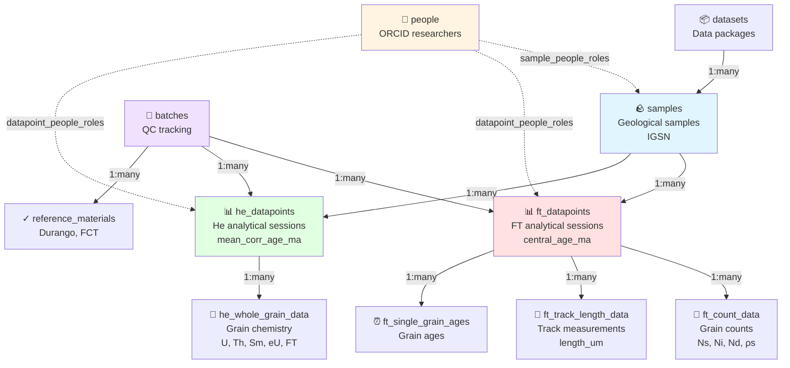

# Database ERD - Simplified View

**Quick reference for understanding the core database structure.**

---

## Core Architecture: Sample → Datapoint → Grain



---

## 16 Tables at a Glance

### 📦 Core Infrastructure (7 tables)

```
datasets ─────┐
              ├─► samples (PRIMARY)
people ───────┤       │
              └─► sample_people_roles (link)

batches ──────┬─► reference_materials (QC)
              │
samples ──────┴─► mounts ─► grains
```

### 🔬 Fission-Track Data (5 tables)

```
samples ─► ft_datapoints ─┬─► ft_count_data
                           ├─► ft_single_grain_ages
                           ├─► ft_track_length_data
                           └─► ft_binned_length_data
```

### 💎 (U-Th)/He Data (2 tables)

```
samples ─► he_datapoints ─► he_whole_grain_data
```

### 🔗 Linking (2 tables)

```
people ─┬─► sample_people_roles ─► samples
        └─► datapoint_people_roles ─┬─► ft_datapoints
                                     └─► he_datapoints
```

---

## Key Relationships

| Parent | Child | Type | Description |
|--------|-------|------|-------------|
| **datasets** | samples | 1:many | One data package contains many samples |
| **samples** | ft_datapoints | 1:many | ⭐ **One sample can have multiple FT analyses** |
| **samples** | he_datapoints | 1:many | ⭐ **One sample can have multiple He analyses** |
| **ft_datapoints** | ft_count_data | 1:many | One analysis has many grain counts |
| **ft_datapoints** | ft_track_length_data | 1:many | One analysis has many track measurements |
| **he_datapoints** | he_whole_grain_data | 1:many | One analysis has many grain results |
| **batches** | ft_datapoints | 1:many | Batch links unknowns to standards |
| **batches** | reference_materials | 1:many | Batch contains QC standards |
| **people** | samples | many:many | Via sample_people_roles |
| **people** | datapoints | many:many | Via datapoint_people_roles |

---

## Primary Keys Quick Reference

| Table | Primary Key | Type |
|-------|-------------|------|
| datasets | id | SERIAL |
| people | id | SERIAL |
| **samples** | **sample_id** | VARCHAR(50) |
| batches | id | SERIAL |
| ft_datapoints | id | SERIAL |
| ft_count_data | id | SERIAL |
| ft_track_length_data | id | SERIAL |
| ft_single_grain_ages | id | SERIAL |
| ft_binned_length_data | id | SERIAL |
| he_datapoints | id | SERIAL |
| he_whole_grain_data | id | SERIAL |
| mounts | id | SERIAL |
| grains | id | SERIAL |
| reference_materials | id | SERIAL |
| sample_people_roles | id | SERIAL |
| datapoint_people_roles | id | SERIAL |

---

## Most Important Fields

### samples (Geological Sample)
```
sample_id              VARCHAR(50)  [PK] Unique sample identifier
igsn                   VARCHAR(20)  [UK] Global geo sample number
latitude, longitude    DECIMAL      GPS coordinates
elevation_m            DECIMAL      Elevation above sea level
lithology              VARCHAR      Rock type (granite, sandstone, etc.)
mineral_type           VARCHAR      apatite, zircon, etc.
n_aft_grains          INTEGER      Number of FT grains analyzed
n_ahe_grains          INTEGER      Number of He grains analyzed
```

### ft_datapoints (FT Analytical Session)
```
id                     SERIAL       [PK]
sample_id              VARCHAR(50)  [FK] → samples
datapoint_key          VARCHAR(100) [UK] User-provided unique ID
batch_id               INTEGER      [FK] → batches
ft_method              VARCHAR      EDM | LA-ICP-MS | Population
central_age_ma         DECIMAL      ⭐ Primary reported age
central_age_error_ma   DECIMAL      ±2σ error
dispersion_pct         DECIMAL      Age scatter (overdispersion)
P_chi2_pct             DECIMAL      Chi-square probability
mean_track_length_um   DECIMAL      Mean confined track length
mean_Dpar_um           DECIMAL      Kinetic parameter (etch pit size)
```

### he_datapoints ((U-Th)/He Analytical Session)
```
id                     SERIAL       [PK]
sample_id              VARCHAR(50)  [FK] → samples
datapoint_key          VARCHAR(100) [UK] User-provided unique ID
batch_id               INTEGER      [FK] → batches
mean_corr_age_ma       DECIMAL      ⭐ Primary reported age (Ft-corrected)
mean_corr_age_error_ma DECIMAL      ±2σ error
mswd_corr              DECIMAL      Mean squared weighted deviation
n_aliquots             INTEGER      Number of grains/aliquots
```

### he_whole_grain_data ((U-Th)/He Grain Result)
```
id                     SERIAL       [PK]
he_datapoint_id        INTEGER      [FK] → he_datapoints
lab_no                 VARCHAR(50)  [UK] Laboratory number
U_ppm                  DECIMAL      Uranium concentration
Th_ppm                 DECIMAL      Thorium concentration
eU_ppm                 DECIMAL      Effective uranium (U + 0.235×Th)
corr_age_ma            DECIMAL      ⭐ Ft-corrected age
FT                     DECIMAL      Alpha ejection correction factor
Rs_um                  DECIMAL      Equivalent sphere radius
```

### ft_count_data (FT Grain Counts)
```
id                     SERIAL       [PK]
ft_datapoint_id        INTEGER      [FK] → ft_datapoints
grain_id               VARCHAR      Grain identifier
Ns                     INTEGER      Spontaneous track count
Ni                     INTEGER      Induced track count
Nd                     INTEGER      Dosimeter track count
rho_s_cm2              DECIMAL      Spontaneous track density
Dpar_um                DECIMAL      Etch pit diameter (kinetics)
```

### ft_track_length_data (Track Measurements)
```
id                     SERIAL       [PK]
ft_datapoint_id        INTEGER      [FK] → ft_datapoints
grain_id               VARCHAR      Grain identifier
track_id               VARCHAR      Track identifier
track_type             VARCHAR      TINT | TINCLE | semi-track
true_length_um         DECIMAL      3D-corrected track length
angle_to_c_axis_deg    DECIMAL      Track orientation
Dpar_um                DECIMAL      Etch pit diameter
```

---

## Data Flow Example

### Single Sample Analysis Journey

```
1. Sample Collection
   ↓
   samples table
   └─ sample_id: "MAL001"
   └─ lithology: "granite"
   └─ mineral_type: "apatite"
   └─ latitude: -13.5, longitude: 34.2

2. FT Analysis (Lab A, 2023)
   ↓
   ft_datapoints table
   └─ datapoint_key: "MAL001-FT-2023"
   └─ central_age_ma: 234.5
   └─ n_grains: 20

   ↓
   ft_count_data (20 rows, one per grain)
   └─ grain_id: "g1", Ns: 45, Ni: 89, Dpar: 2.1
   └─ grain_id: "g2", Ns: 52, Ni: 95, Dpar: 2.3

   ↓
   ft_track_length_data (250 rows, individual tracks)
   └─ grain_id: "g1", track_id: "t1", length: 14.5 µm
   └─ grain_id: "g1", track_id: "t2", length: 13.8 µm

3. (U-Th)/He Analysis (Lab B, 2024)
   ↓
   he_datapoints table
   └─ datapoint_key: "MAL001-AHe-2024"
   └─ mean_corr_age_ma: 187.3
   └─ n_aliquots: 5

   ↓
   he_whole_grain_data (5 rows, one per grain)
   └─ lab_no: "AHe-001", U: 25 ppm, Th: 85 ppm, age: 189.2 Ma
   └─ lab_no: "AHe-002", U: 30 ppm, Th: 92 ppm, age: 185.7 Ma

4. Re-analysis (Lab A, 2025) - Different method
   ↓
   ft_datapoints table (NEW ROW)
   └─ datapoint_key: "MAL001-FT-LA-2025"
   └─ ft_method: "LA-ICP-MS" (previously was "EDM")
   └─ central_age_ma: 238.1 (slightly different from 2023)
```

**Result:** MAL001 now has:
- 2 FT datapoints (EDM 2023, LA-ICP-MS 2025)
- 1 He datapoint (2024)
- Multiple grain-level records under each datapoint

---

## Common Queries

### Get all analyses for a sample
```sql
SELECT 'FT' as method, datapoint_key, central_age_ma as age_ma, analysis_date
FROM ft_datapoints WHERE sample_id = 'MAL001'
UNION
SELECT 'He' as method, datapoint_key, mean_corr_age_ma, analysis_date
FROM he_datapoints WHERE sample_id = 'MAL001'
ORDER BY analysis_date;
```

### Get sample with latest ages
```sql
SELECT s.sample_id, s.lithology,
       (SELECT central_age_ma FROM ft_datapoints
        WHERE sample_id = s.sample_id
        ORDER BY analysis_date DESC LIMIT 1) as latest_ft_age,
       (SELECT mean_corr_age_ma FROM he_datapoints
        WHERE sample_id = s.sample_id
        ORDER BY analysis_date DESC LIMIT 1) as latest_he_age
FROM samples s;
```

### Get QC performance for batch
```sql
SELECT b.batch_name, rm.material_name,
       rm.expected_age_ma, rm.measured_age_ma,
       ABS(rm.measured_age_ma - rm.expected_age_ma) as deviation_ma,
       ROUND(100.0 * ABS(rm.measured_age_ma - rm.expected_age_ma) / rm.expected_age_ma, 2) as error_pct
FROM batches b
JOIN reference_materials rm ON b.id = rm.batch_id
WHERE b.batch_name = 'Batch-2024-001';
```

---

## See Also

- **Full ERD:** `DATABASE_ERD.md` (complete detailed diagram)
- **Schema SQL:** `scripts/db/schema-earthbank-v2.sql` (1090 lines)
- **Table Docs:** `readme/database/tables/*.md` (21 files)

---

**Last Updated:** 2025-11-18
